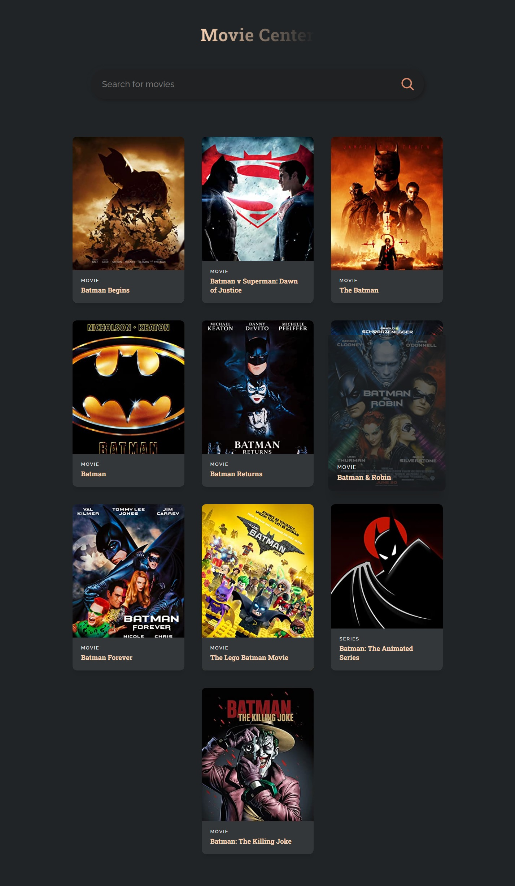
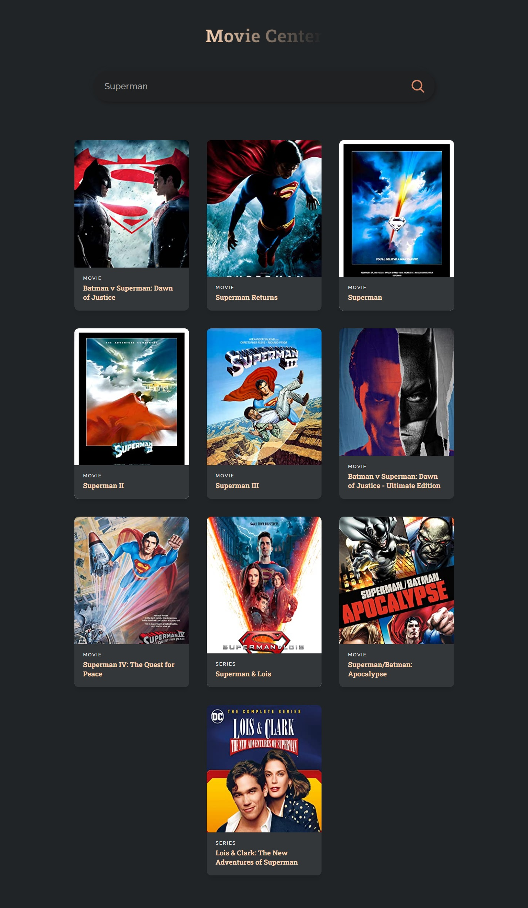

# React Mini Project
React Mini Project - Movie Center

## Table of contents
* [General info](#general-info)
* [Screenshots](#screenshots)
* [Projects](#Projects)
* [Code Examples](#code-examples)

## General info
Learning JavaScript libraries and frameworks can be overwhelming. There are many libraries to choose from, and no proper step-by-step guides that’ll teach you how to use these libraries to their fullest potential. That’s why, in this video, you’ll learn the most popular JavaScript library, used by hundreds of thousands of developers worldwide - React.js.

## Screenshots




## Projects
- React JS
- ReactDom
- Api

## Code Examples
Show examples of usage:
```
return (
    <div className="app">
      <h1>Movie Center</h1>

      <div className="search">
        <input placeholder="Search for movies" value={searchTerm} onChange={(e) => setSearchTerm(e.target.value)} />
         searchMovies(searchTerm)} />
      </div>
      {
        movies?.length > 0
          ? (
            <div className="container">
              {movies.map((movie) => (
                <MovieCard movie={movie}/>
              ))}
            </div>
          ) : (
            <div className="empty">
              <h2>No movies found</h2>
            </div>
          )
      }
    </div>
  );

```
